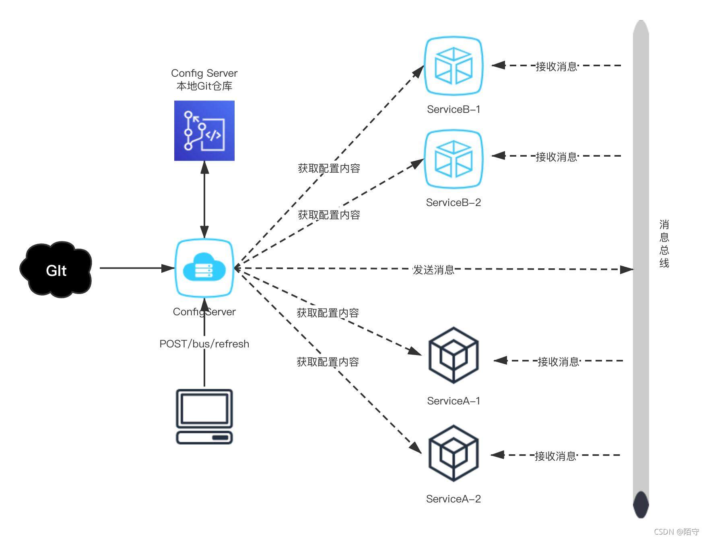
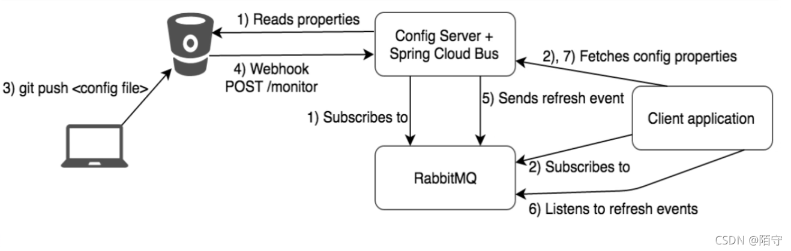

# SpringCloud Bus+RabbitMQ+Config实现分布式配置中心消息广播
## SpringCloud Bus消息总线概述
1. SpringCloud Config实现自动刷新配置（分布式自动刷新配置功能）：SpringCloud Bus 配合 SpringCloud Config 使用可以实现配置的动态刷新
2. SpringCloud Bus 将分布式系统的节点与轻量级消息代理连接起来的消息总线。Bus 总线支持两种消息代理：RabbitMQ 和 Kafka。
   SpringCloud Bus 能管理和传播分布式系统间的消息。就像一个分布式执行器，可用于广播状态更改、事件推送等，也可以当做微服务间的通信通道
   
## 基本原理
   ConfigClient 实例都监听 MQ 中同一个 topic（默认是springCloudBus）。当服务刷新数据的时候，它会吧这个消息放到主题中，这样其他监听同一个主题的服务就能得到通知，进而更新自身的配置
## Springcloud Bus动态刷新全局广播
1、利用消息总线触发一个客户端的 /bus/refresh，而刷新所有客户端的配置。
2、利用消息总线触发一个服务端ConfigServer的 /bus/refresh 端点，而刷新所有客户端的配置。
显然 2 比 1 更加合适，原因如下：
（1）打破了微服务的职责单一性，因为微服务本身是业务模块，它本不应该承担配置刷新的职责。
（2）破坏了微服务个节点的对等性。
（3）有一定的局限性。例如：微服务在迁移时，他的网络地址常常会发生变化，此时如果想要做到自动刷新，那么就会增加更多的修改。
## 配置中心服务端配置
### 引入pom依赖
```pom
<!--SpringCloud config配置中心客户端依赖-->
<dependency>
   <groupId>org.springframework.cloud</groupId>
   <artifactId>spring-cloud-starter-config</artifactId>
</dependency>
<!--Eureka客户端-->
<dependency>
   <groupId>org.springframework.cloud</groupId>
   <artifactId>spring-cloud-starter-netflix-eureka-client</artifactId>
</dependency>
<dependency>
   <groupId>org.springframework.boot</groupId>
   <artifactId>spring-boot-starter-web</artifactId>
</dependency>

<dependency>
   <groupId>org.springframework.boot</groupId>
   <artifactId>spring-boot-starter-actuator</artifactId>
</dependency>
```
### 服务端application.yml配置文件
```yml
# 服务端口号
server:
  port: 3344

# 服务名称
spring:
  application:
    name: cloud-config-center-server


  # 配置中心
  cloud:
    config:
      # 读取分支
      label: master
      server:
        git:
          #填写自己的github路径
          uri: https://gitee.com/li-hw/springcloud-config-repository.git
          #搜索目录
          search-paths:
            - springcloud-config-repository
          # 连接 github 的账户（登录的账号密码）
          username: 账号
          password: 密码
          # 设置连接 github 超时时间
          timeout: 60
          # 强制拉取
          force-pull: true

  # RabbitMQ
  rabbitmq:
    host: localhost
    port: 5672
    username: guest
    password: guest

# rabbitmq相关配置，暴露bus刷新配置的端点
management:
  endpoints:
    web:
      exposure:
        include: "bus-refresh"

# 服务注册中心
eureka:
  client:
    #表示收将自己注册到EurekaServer，默认为true
    register-with-eureka: true
    #是否从EurekaServer抓取已有的注册信息，默认为true，单节点无所谓，集群必须设置为true才能配合ribbon使用负载均衡
    fetchRegistry: true
    service-url:
      #      defaultZone: http://localhost:7001/eureka  #单机版
      defaultZone: http://eureka7001.com:7001/eureka,http://eureka7002.com:7002/eureka  #集群版
  instance:
    instance-id: config-center-server3344
    #访问路径可以显示IP地址
    prefer-ip-address: true
    #eureka客户端向服务端发送心跳的时间间隔，单位为秒（默认为30秒）
    lease-renewal-interval-in-seconds: 1
    #eureka服务端在收到最后一次心跳后等待时间上限，单位为秒（默认为90秒），超时将删除服务
    lease-expiration-duration-in-seconds: 2
```
### 客户端bootstrap.yml配置文件
```yml
server:
  port: 3366

spring:
  application:
    name: cloud-config-center-client
  cloud:
    # Config 客户端配置
    config:
      discovery:
        #开启服务发现
        enabled: true
        # 服务id
        service-id: cloud-config-center-server
      label: master #分支名称
      name: config  #配置文件名
      profile: dev  #配置文件后缀名称
      #uri: http://localhost:3344 #配置中心服务端地址

# 暴露监控断点
management:
  endpoints:
    web:
      exposure:
        include: "*"

# 服务注册中心
eureka:
  client:
    #表示收将自己注册到EurekaServer，默认为true
    register-with-eureka: true
    #是否从EurekaServer抓取已有的注册信息，默认为true，单节点无所谓，集群必须设置为true才能配合ribbon使用负载均衡
    fetchRegistry: true
    service-url:
      #      defaultZone: http://localhost:7001/eureka  #单机版
      defaultZone: http://eureka7001.com:7001/eureka,http://eureka7002.com:7002/eureka  #集群版
  instance:
    instance-id: config-center-client3366
    #访问路径可以显示IP地址
    prefer-ip-address: true
    #eureka客户端向服务端发送心跳的时间间隔，单位为秒（默认为30秒）
    lease-renewal-interval-in-seconds: 1
    #eureka服务端在收到最后一次心跳后等待时间上限，单位为秒（默认为90秒），超时将删除服务
    lease-expiration-duration-in-seconds: 2
```
### 主启动类
```java
@SpringBootApplication
@EnableEurekaClient
public class ConfigCenterClientMain3366 {
    public static void main(String[] args) {
        SpringApplication.run(ConfigCenterClientMain3366.class, args);
    }
}
```

## 测试
启动微服务注册中心、Config服务端3344、Config客户端3355(与3366)。修改 config-dev.yml 配置文件信息并提交 github 或者 gitee。刷新3344时可以正常获取最新的配置信息，刷新3355、3366时没有反应。此时使用postman通过POST请求访问http://localhost:3344/actuator/bus-refresh或 curl 指令curl -X POST "http://localhost:3344/actuator/bus-refresh，然后在刷新3355、3366，结果能够正常同步到最新的配置信息

## Springcloud Bus动态刷新定点通知
公式（模板）：http://配置中心服务端地址:配置中心服务端的端口号/actuator/bus-refresh/{destination}
只通知 3355，不通知3366：curl -X POST "http://localhost:3344/actuator/bus-refresh/cloud-config-center-client:3355"，注意此处动态定点通知通常使用的是 微服务名称+端口号 的形式。当只有微服务名称的时候，表示的是改微服务的下所有的负载均衡全部被刷新。

